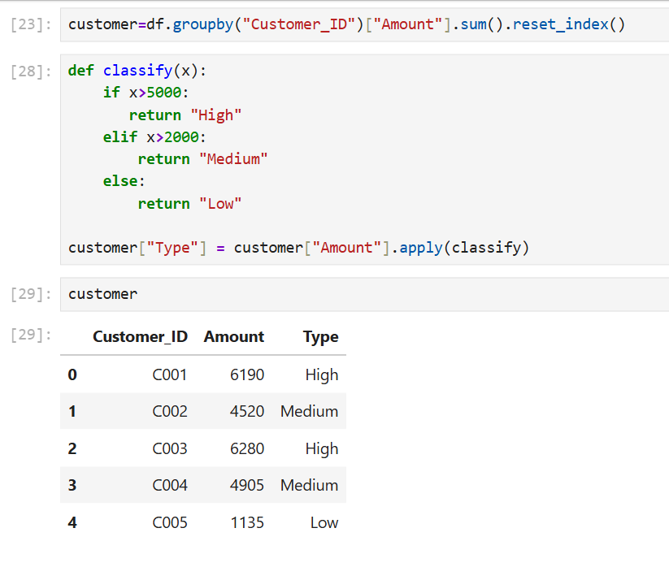

# 👥 Customer Segmentation Analysis (SQL + Python)

## 🎯 Objective  
To analyze customer purchase data and classify customers into different segments based on their spending behavior.

---

## 🛠️ Tools Used  
- SQL (GROUP BY, CASE statements)  
- Python (Pandas)  

---

## 📂 Dataset  
- Sales dataset used for customer analysis  

---

## 🔍 Analysis Performed  
- Grouped customers based on total spending  
- Calculated total purchase amount per customer  
- Classified customers into High, Medium, and Low segments  
- Used SQL CASE statements and Python functions for classification  

---

## 📈 Key Insights  

- High-value customers: C003, C001  
- Medium-value customers: C004, C002  
- Low-value customer: C005  
- High-value customers contribute the most revenue  

---

## 💡 Business Impact  

- Helps businesses focus on high-value customers  
- Supports targeted marketing strategies  
- Improves customer retention planning  

---

## 📌 Skills Demonstrated  
- Data Aggregation  
- SQL CASE Logic  
- Python Data Analysis  
- Customer Segmentation  
- Business Insight Generation

## 🐍 Python Implementation

The customer segmentation was also performed using Python (Pandas) to group customers and classify them based on total spending.

### 📌 Code

```python
import pandas as pd

# Load data
df = pd.read_csv("orders.csv")

# Group customers
customer = df.groupby("Customer_ID")["Amount"].sum().reset_index()

# Classification function
def classify(x):
    if x > 5000:
        return "High"
    elif x > 2000:
        return "Medium"
    else:
        return "Low"

# Apply classification
customer["Type"] = customer["Amount"].apply(classify)

# Display result
print(customer)

```
Python_Output:



## 🧾 SQL Implementation

Customer segmentation was performed using SQL by grouping customers based on total spending and classifying them using a CASE statement.

---

### 📌 SQL 

```sql
SELECT 
    Customer_ID,
    SUM(Amount) AS Total_Spent,
    CASE
        WHEN SUM(Amount) > 5000 THEN 'High'
        WHEN SUM(Amount) > 2000 THEN 'Medium'
        ELSE 'Low'
    END AS Customer_Type
FROM orders
GROUP BY Customer_ID
ORDER BY Total_Spent DESC;


```
SQL_Output:


